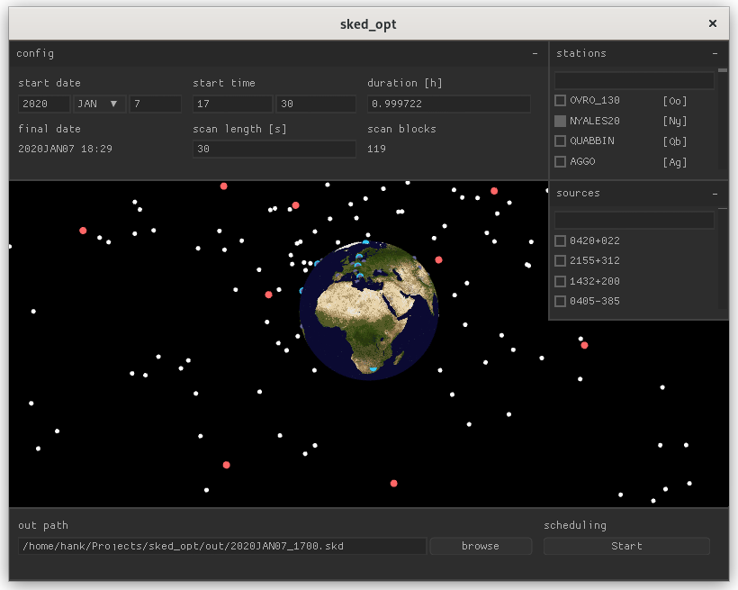

Generate optimal VLBI schedules (`+.skd+`) using a built-in configuration tool (seen below) or XML from https://github.com/TUW-VieVS/VieSchedppGUI[VieSched++'s GUI]. The goal of this tool is to explore the use of ILP in VLBI scheduling.

[figure,align="center"]

== Usage
[source,sh]
----
#!/bin/bash
git clone https://github.com/hankotanks/sked_opt.git
cd ./sked_opt

# build project and internal dependencies
make && make clean

# download current VLBI catalogs
source catalogs.sh

# run with an example VieSched++ configuration (optional)
./opt ./examples/r1928_truncated/VieSchedpp.xml
----

== Dependencies
This project was developed on Linux, specifically Debian GNU/Linux 12 (bookworm). 
All dependencies are packaged and built alongside the project!

== Attributions
The source of the following projects has been included in an unmodified state in accordance with their licenses.

http://iausofa.org/current_C.html[`+SOFA+`] (Issue 2023-10-11):: Distributed by the IAU. Used for GMST correction and Julian date conversion.
https://sourceforge.net/projects/lpsolve/[`+lp_solve+`] (5.5.2.11):: Used to solve the scheduling ILP.
https://sourceforge.net/projects/tinyfiledialogs/[`+tinyfiledialogs+`]:: File dialogs for the user interface.
https://github.com/ooxi/xml.c[`+xml.c+`]:: Allows parsing configuration files from VieSched++. Thanks to ooxi!
https://github.com/ColleagueRiley/RGFW[`+RGFW+`], https://github.com/Immediate-Mode-UI/Nuklear[`+Nuklear+`]:: These two headers are packaged together as part of https://github.com/hankotanks/glenv.h[`glenv.h`]. Many thanks to ColleagueRiley and Micha Mettke respectively.

The following assets are used in this project.

* https://visibleearth.nasa.gov/images/57752/blue-marble-land-surface-shallow-water-and-shaded-topography[NASA Blue Marble]

=== _Personal Reference_
[source,sh]
----
#!/bin/bash

# check namespacing (example)
ctags -x --c-kinds=+pstuvg-em ./include/cat.h | grep -v -E '^(CAT_H__|X)'

# check for memory leaks (using suppression from glenv)
valgrind --leak-check=full --track-origins=yes --log-file=./valgrind.log --suppressions=./glenv/glenv.supp ./opt
----
